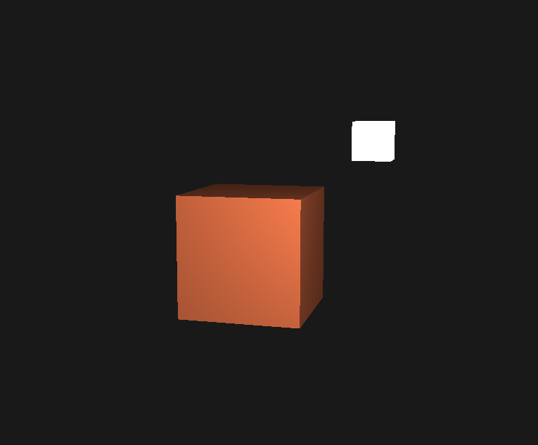
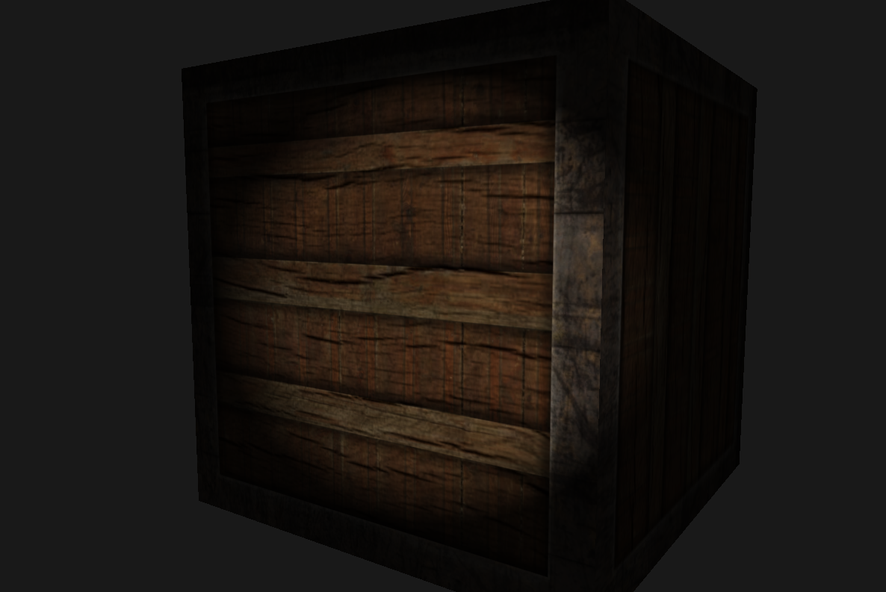
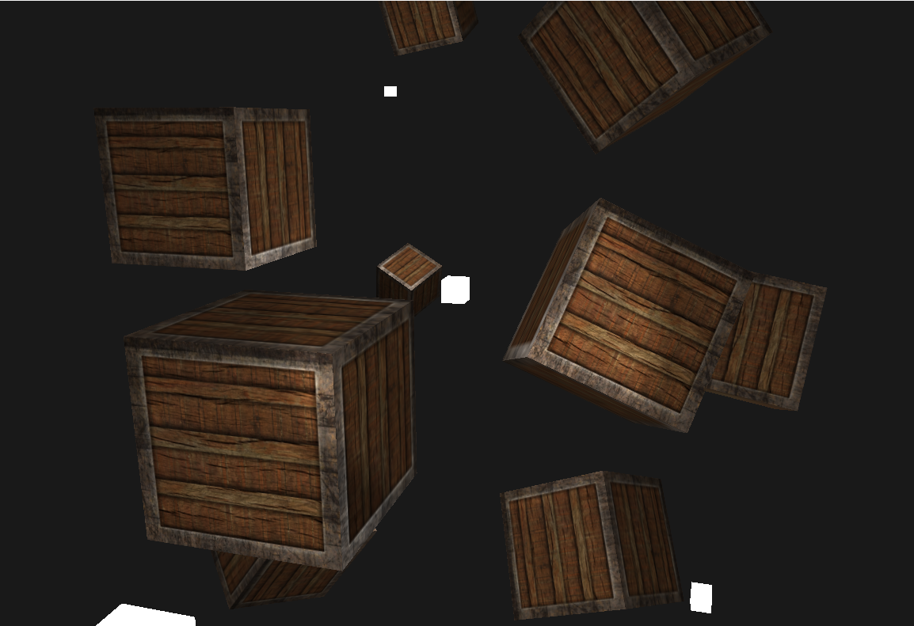

Modern OpenGL   
===============   

Description      
------------      

This project's purpose is to realise a graphical architecture of a game engine.    

# Architecture    
<pre>
├── Mordern-OpenGL.sln   
├── Assets   
│   ├── fonts   
│   ├── log   
|   ├── meshes
|   |   ├── cube.obj
|   |   └── 
|   |
|   ├── shaders
|   |   ├── lightCubeFragmentSource.shader
|   |   ├── lightCubeVertexSource.shader
|   |   ├── lightFragmentSource.shader
|   |   └── lightVertexSource.shader
|   |
|   └── textures
|       ├── awesomeface.png
|       ├── container.jpg
|       ├── container2.png
|       └── container2_specular.png
|   
│── External  
|       ├── include
|             ├── glad ( folder )
|             ├── GLFW ( folder )
|             ├── ImGui (folder )
|             ├── KHR ( folder )
|             └── stb_image (folder )
|       ├── libs
|       └── src
|             ├── glad ( folder )
|             └── ImGui (folder )
|       
└── Source   
    ├── include   
        ├── Core   
        |     ├── DataStructure
        |     |     └── graph.h
        |     ├── FolderDebug
        |     |     └── log.h
        |     └── Maths
        |           ├── mat4.h
        |           ├── vec.h
        |           ├── vec2.h
        |           ├── vec3.h
        |           └── vec4.h
        ├── LowRenderer   
        |     ├── camera.h
        |     ├── light.h
        |     └── mesh.h
        ├── Physics   
        |     └── transform.h
        ├── Ressources   
        |       ├── model.h
        |       ├── resourceManager.h
        |       ├── scene.h
        |       ├── shader.h
        |       └── texture.h
        |
        └── app.h
    └── src   
        ├── Core   
        |     ├── DataStructure
        |     |     └── graph.cpp
        |     ├── FolderDebug
        |     |     └── log.cpp
        |     └── Maths
        |           ├── mat4.cpp
        |           ├── vec.cpp
        |           ├── vec2.cpp
        |           ├── vec3.cpp
        |           └── vec4.cpp
        ├── LowRenderer   
        |     ├── camera.cpp
        |     ├── light.cpp
        |     └── mesh.cpp
        ├── Physics   
        |     └── transform.cpp
        ├── Ressources   
        |       ├── model.cpp
        |       ├── resourceManager.cpp
        |       ├── scene.cpp
        |       ├── shader.cpp
        |       └── texture.cpp
        |
        ├── app.cpp
        └── main.cpp

</pre>
# FeaturesRenderer       
      
## Implementation of debug          
     
- Log : saves messages to the screen or to a file.     
- DEBUG_LOG : have same functioning than log class but it display the messages in the output console of visual studio.    
   
 
## Implementation of Resource Manager    
    
- IResource : abstract class that store resources used during the project (Shaders, Textures, Model ,...)        
- ResourceManager : stores IResources that you are able to retrieve or create from a name.          

## Implementation of Model 3D      
      
Model : inherits from IResource, represents a basic 3D model whose data is intended to fill a vertex buffer and an index buffer.    

## Implementation of Model 3D          
        
- App : open a GLFW window, initialize OpenGL with GLAD, repaint
the background in blue, and exits when the Esc key is pressed.      
    
- Shader : inherits from IResource      
    
## Implementation of Camera    

- Z : move forward    
- Q : move left    
- S : move back    
- D : move right    
       
- mouse : rotation     

## Implementation of Lights       
   
Lights :      
    
    
    
    
  

## Implementation of Textures      
    

Texture : inherits from IResource  

Library used 
-------------

- GLFW3     
- IMGUI      
- GLAD      
- KHR    
- STD_IMAGE        
- TINYOBJ      
- ToolBox ( personnal math library that contains matrix and vectors)     

Made with    
------------    
- VisualStudio   
- C++  

Interesting Link  
----------------   

- Color interpolation : https://codeplea.com/triangular-interpolation      
- Texture : https://learnopengl.com/Getting-started/Textures        
- Camera understanding : https://www.geertarien.com/blog/2017/07/30/breakdown-of-the-lookAt-function-in-OpenGL/       
- 3D model loader : https://vulkan-tutorial.com/Loading_models  
- Lights : https://learnopengl.com/Lighting/Basic-Lighting    

